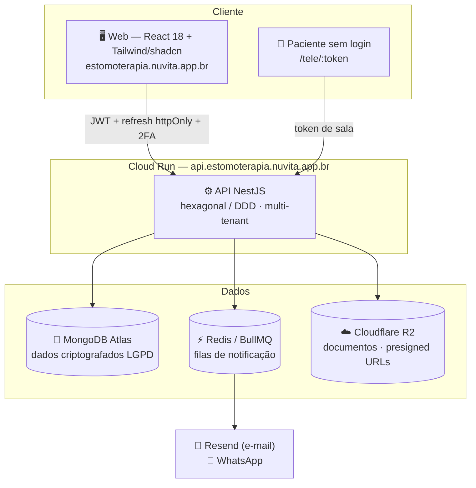

<div align="center">

<picture>
  <source media="(prefers-color-scheme: dark)" srcset="docs/brand/nuvita-logo-dark.svg">
  
</picture>

### Gestão de saúde na nuvem — edição estomaterapia

**Plataforma SaaS multi-tenant de gestão clínica**, focada em clínicas de
estomaterapia (avaliação e acompanhamento de feridas).

[](https://github.com/ericolimaeducador-ux/Nuvita_2.1/actions/workflows/ci.yml)

[Funcionalidades](#-funcionalidades) ·
[Arquitetura](#%EF%B8%8F-arquitetura) ·
[Segurança](#-segurança--lgpd) ·
[Rodando localmente](#-rodando-localmente) ·
[Documentação](#-documentação-complementar)

</div>

---

## 💡 O que é o Nuvita 2.1

O **Nuvita 2.1** é uma plataforma de gestão clínica na nuvem, especializada para
o consultório/clínica de **estomaterapia**: acompanhamento de feridas crônicas
e agudas, do primeiro atendimento à alta, com escalas clínicas calculadas,
telemedicina integrada e financeiro adaptado à realidade do negócio (consultas,
venda de produtos para ferida, atendimento avulso por telemedicina e
consultoria para hospitais e clínicas de idosos).

Cada clínica é um **tenant isolado**: dados, usuários, agenda e financeiro são
segregados por clínica, com um painel **super-admin** global para
provisionamento e gestão fina de permissões.

## ✨ Funcionalidades

| Módulo | O que faz |
|---|---|
| 🧑‍⚕️ **Pacientes** | Cadastro completo com **criptografia de dados pessoais (LGPD)** em repouso; busca por hash cego; observações clínicas |
| 📅 **Agenda** | Calendário e visão em lista; cada profissional vê a própria agenda |
| 📋 **Prontuário eletrônico** | Evoluções **SOAP** e consulta de enfermagem em estomaterapia (motivo, comorbidades, mobilidade, escore de Braden, curativo atual, adesão ao tratamento, evolução, plano); **assinatura digital imutável** — prontuário assinado não se altera, correções entram como addendum |
| 🩹 **Feridas** | Cadastro de feridas por paciente, avaliações estruturadas (medidas, perfil tecidual, exsudato, achados perilesionais), motor de risco auditável, escalas clínicas **PUSH 3.0** e **RESVECH 2.0** calculadas automaticamente, timeline com tendência de cicatrização |
| 🎥 **Telemedicina** | Vídeo **WebRTC P2P** com sinalização própria; paciente entra **sem login** via link tokenizado (`/tele/:token`); tela de atendimento em **split-screen** (vídeo + prontuário de enfermagem + avaliação de ferida lado a lado, sem sair da consulta); eventos de sala auditados |
| 📄 **Documentos** | Upload/download seguro via **presigned URLs** (Cloudflare R2/S3); verificação server-side (magic bytes + hash), remoção de metadados EXIF/GPS de fotos; checklist de documentos por paciente |
| 💰 **Financeiro** | Lançamentos por categoria (consulta, venda/compra de produto, telemedicina avulsa, consultoria a hospitais e clínicas de idosos), composição por categoria e evolução mensal em gráfico |
| 🔔 **Notificações** | E-mail (Resend) e **WhatsApp** processados por **fila** (BullMQ), com janela de envio 8h–22h |
| 📊 **Analytics** | Painéis e indicadores operacionais da clínica |
| 🛒 **Produtos** | Catálogo de produtos usados no cuidado de feridas (curativos, coberturas etc.) |

### Administração e acesso

- **Papéis**: `SUPER_ADMIN`, `ADMIN`, `ENFERMEIRO` (estomaterapeuta),
  `SECRETARIA`, `PACIENTE`.
- **2FA TOTP obrigatório** para super-admin, admin e enfermeiro.
- **Permissões por módulo** (`packages/shared/src/auth/permissao.ts`): cada
  papel tem um conjunto padrão; o super-admin concede/revoga **exceções por
  usuário** (o banco guarda apenas as exceções e `resolvePermissoes()`
  calcula o efetivo). Frontend e API compartilham a mesma regra via
  `packages/shared`.
- **Multi-tenancy**: quase toda rota exige tenant (clínica) resolvido por
  `TenantMiddleware` + `TenantRequiredGuard`; rotas globais usam
  `@AllowWithoutTenant`.

## 🏗️ Arquitetura

### Stack

| Camada | Tecnologias |
|---|---|
| **API** | NestJS 10 · TypeScript · MongoDB (Mongoose) · Redis + BullMQ (filas) |
| **Web** | React 18 · Vite · TypeScript · Tailwind CSS · shadcn/ui (Radix) · React Router 6 · TanStack Query · axios |
| **Infra** | Docker Compose (dev) · Cloud Run (API) · GitHub Pages + Firebase Hosting (web/api) · Cloudflare R2/S3 (documentos) |
| **Segurança** | JWT access + refresh httpOnly · 2FA TOTP · bcrypt · Helmet/CSP/HSTS · criptografia de dados de paciente (LGPD) |

### Estrutura do monorepo (npm workspaces)

```text
apps/api          API NestJS (workspace @nuvita/api)
apps/web          Frontend React (workspace @nuvita/web)
packages/shared   Contratos, enums e regras compartilhadas (papéis, permissões)
scripts/          Bootstrap, seeds de demonstração e utilitários (TOTP, GCP)
infra/            Notas de integração e PRODUCTION-CHECKLIST.md
docs/             Roadmap, relatório de segurança/modernização, identidade visual
```

### API — arquitetura hexagonal / DDD

Cada módulo em `apps/api/src/modules/<nome>/` segue a mesma anatomia:

```text
domain/           Entidades e regras de negócio puras
application/      Casos de uso (services) + ports (interfaces) + DTOs
infrastructure/   Adapters: Mongoose (schemas/repos), S3, filas, provedores
presentation/     Controllers, guards e decorators HTTP
```

Módulos: `auth`, `clinicas`, `pacientes`, `agendamentos`, `prontuarios`,
`feridas`, `documentos`, `notificacoes`, `financeiro`, `telemedicina`,
`analytics`, `produtos`, `checklist-documentos`, `observacoes-paciente`,
`super-admin`, `health` — mais `common/tenancy` (resolução de tenant por
request) e `common/security`.



## 🔐 Segurança & LGPD

- **Dados de paciente criptografados** em repouso (`PATIENT_DATA_ENCRYPTION_KEY`),
  com hash cego (`PATIENT_DATA_HASH_KEY`) para busca sem descriptografar.
- **Prontuário assinado é imutável** (`PRONTUARIO_SIGNATURE_SECRET`) — qualquer
  correção entra como addendum, preservando a trilha de auditoria.
- **Autenticação**: JWT de acesso curto + refresh em cookie `httpOnly`
  (`path=/auth`), senhas com bcrypt, **2FA TOTP obrigatório** para papéis
  privilegiados, throttle global + lockout progressivo por conta e detecção
  de reuso de refresh token (revoga a família inteira de sessão).
- **Upload de documentos**: verificação server-side de existência, tamanho,
  hash e magic bytes antes de confirmar; remoção de metadados EXIF/GPS de
  fotos de ferida.
- **Hardening HTTP**: Helmet, CSP e HSTS ligados em produção; Swagger fechado
  fora de desenvolvimento.
- **Segredos**: `CONFIG_SOURCE` desacopla a fonte de segredos do `NODE_ENV`;
  produção usa variáveis de ambiente via Cloud Run — nada de segredo em
  repositório.
- **Deploy sem chave**: CD autentica no GCP via **Workload Identity Federation**.

Relatório completo de segurança e roadmap de modernização em
[`docs/SECURITY-E-MODERNIZACAO-2026-07.md`](docs/SECURITY-E-MODERNIZACAO-2026-07.md).

## 🚀 Rodando localmente

Pré-requisitos: **Node 20+**, **Docker** (para MongoDB e Redis) e npm.

```bash
git clone https://github.com/ericolimaeducador-ux/Nuvita_2.1.git
cd Nuvita_2.1
npm install

# 1) Infra de dev (MongoDB 7 + Redis 7)
docker compose up -d mongodb redis

# 2) Configuração da API — o dev server lê apps/api/.env.local (ou .env)
cp .env.example apps/api/.env.local
#    Preencha ao menos JWT_*_SECRET, PATIENT_DATA_ENCRYPTION_KEY (32 bytes
#    base64), PATIENT_DATA_HASH_KEY, PRONTUARIO_SIGNATURE_SECRET e
#    BOOTSTRAP_SECRET. Gerador rápido:
node -e "console.log(require('crypto').randomBytes(32).toString('base64'))"

# 3) API (http://localhost:3010 — Swagger em /docs no modo development)
npm run api:dev

# 4) Web (http://localhost:5173, proxy para a API)
npm run dev -w @nuvita/web
```

> ⚠️ **Atenção ao `.env`**: `apps/api/.env.local`/`.env` é o que a API carrega
> em dev (`envFilePath: ['.env.local', '.env']` relativo a `apps/api`).
> Nunca aponte o dev local para banco de produção.

### Stack completa via Docker

```bash
cp .env.example .env    # docker compose lê o .env da raiz
docker compose up -d    # mongodb + redis + api + web
```

## 📏 Convenções importantes (leia antes de mexer)

- **`packages/shared` é importado por caminho relativo** (ex.:
  `../../../../packages/shared/src/auth`), não por alias. Por isso o build da
  API emite em `dist/apps/api/src/main.js` — o script `start` já aponta pra lá.
- **A API não tem prefixo `/api`**: o front chama `/auth`, `/pacientes`,
  `/feridas`… e o proxy (Vite em dev, nginx em produção) encaminha esses
  paths para a API preservando-os. Isso é necessário porque o cookie httpOnly
  de refresh tem `path=/auth`. Como as rotas do SPA colidem com as da API, o
  proxy distingue navegação (Accept: text/html → SPA) de XHR (→ API).
- **Validação global**: `ValidationPipe` com `whitelist` +
  `forbidNonWhitelisted` + `transform` — todo body precisa de DTO com
  decorators; campo desconhecido derruba a request com 400.
- **Datas-calendário** (campos de `<input type="date">`) são gravadas como
  meia-noite UTC; no front, exiba com `formatData()` de `apps/web/src/utils.ts`
  (formatar com dayjs local mostraria o dia anterior no fuso do Brasil).
  Timestamps de evento (`criadoEm`, `dataAtendimento`…) usam dayjs local normal.
- **Prontuário assinado é imutável** — correções entram como addendum.
- **Identidade visual**: fonte única de marca em `apps/web/src/lib/brand.ts`
  (logos, CNPJ, endereço); documentos impressos usam
  `DocumentoTimbre`/`DocumentoRodape`. O logo vetorial atual (o mesmo do app)
  fica em `apps/web/src/components/Logo.tsx`; os PNGs de `brand.ts` servem só
  para documentos impressos.
- **Commits**: conventional commits em pt-BR (`fix(feridas): …`,
  `feat(financeiro): …`), como no histórico.

## ✅ Qualidade e CI/CD

```bash
npm run build -w @nuvita/api        # build (o workspace api não tem typecheck)
npm test  -w @nuvita/api            # testes da API
npm run lint -w @nuvita/api         # eslint da API
npm run build -w @nuvita/web        # tsc --noEmit + build de produção do front
```

- **CI** (`.github/workflows/ci.yml`): roda em pushes/PRs para `main` —
  build/type-check/testes da API e build do web.
- **CD da API** (`deploy-api.yml`): push em `main` faz deploy no **Cloud Run**
  (região `southamerica-east1`) autenticando via **Workload Identity
  Federation** (sem chave de service account). Env de produção gerado por
  `node scripts/gen-cloudrun-env.cjs`.
- **CD do Web** (`deploy-pages.yml`): push em `main` publica no GitHub Pages
  (domínio `estomoterapia.nuvita.app.br`; API em
  `api.estomoterapia.nuvita.app.br` via Firebase Hosting → Cloud Run).
- Pendências de go-live e rotação de segredos: veja
  [`infra/PRODUCTION-CHECKLIST.md`](infra/PRODUCTION-CHECKLIST.md).

## ⚙️ Variáveis de ambiente (principais)

| Variável | Para quê |
|---|---|
| `MONGODB_URI` / `REDIS_URL` | Banco e fila |
| `JWT_ACCESS_SECRET` / `JWT_REFRESH_SECRET` | Tokens de sessão |
| `PATIENT_DATA_ENCRYPTION_KEY` / `PATIENT_DATA_HASH_KEY` | Criptografia LGPD dos dados de paciente (32 bytes base64) |
| `PRONTUARIO_SIGNATURE_SECRET` | Assinatura imutável de prontuários |
| `BOOTSTRAP_SECRET` | Autoriza o bootstrap inicial de clínica+admin |
| `NODE_ENV` + `CONFIG_SOURCE` | Postura de segurança × fonte de segredos |
| `ALLOW_PUBLIC_REGISTRATION` | Habilita `/auth/register` público (desligado em produção por padrão) |
| `DOCUMENT_STORAGE_*` | Bucket S3/R2 de documentos (presigned URLs) |
| `RESEND_API_KEY`, `EVOLUTION_*`/`ZAPI_*` | Provedores de e-mail e WhatsApp das notificações |
| `CORS_ORIGIN` | Origens permitidas do front |

A lista completa e comentada está em [`.env.example`](.env.example).
**Nunca** commite segredos.

## 📚 Documentação complementar

- [`docs/ULTRAPLAN.md`](docs/ULTRAPLAN.md) — plano de migração e roadmap
- [`docs/SECURITY-E-MODERNIZACAO-2026-07.md`](docs/SECURITY-E-MODERNIZACAO-2026-07.md) — varredura de segurança e roadmap de modernização
- [`apps/web/README.md`](apps/web/README.md) — detalhes do frontend
- [`infra/`](infra/) — checklist de produção

## 📄 Propriedade intelectual

© Nuvita — CNPJ 55.747.955/0001-07 · Rua Levindo Lopes, 391 – Funcionários,
Belo Horizonte/MG. Software proprietário; todos os direitos reservados.
Este repositório não concede licença de uso, cópia ou distribuição.

---

<div align="center">
<sub>Feito com 💚 em Belo Horizonte · <b>Nuvita — gestão de saúde na nuvem</b></sub>
</div>
