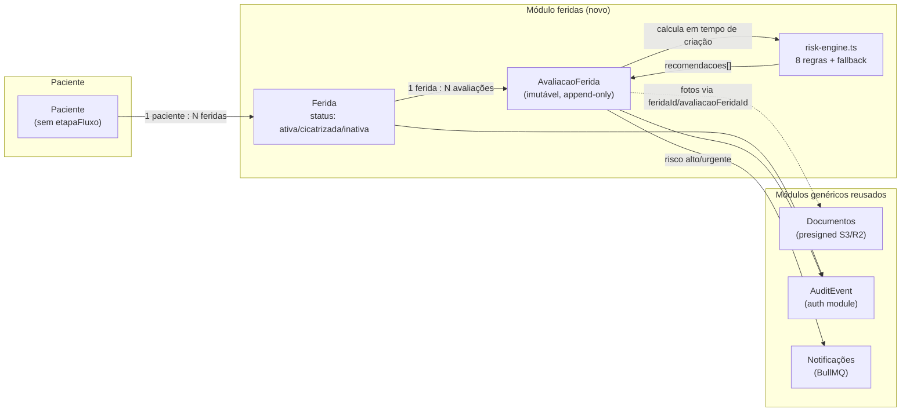
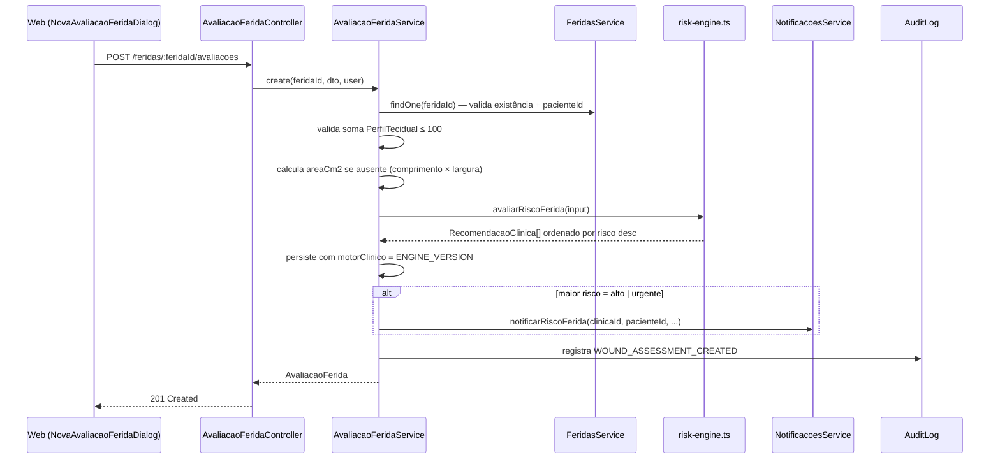
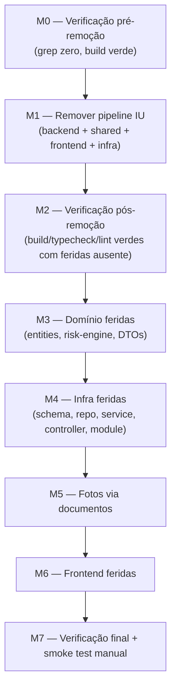

# Ultraplan — Nuvita 2.1 (estomaterapia)

> Substitui a versão anterior deste documento (focada só em arquitetura/infra
> genérica). Esta versão incorpora o plano de migração de produto —
> substituição do pipeline de incontinência urinária (IU) pelo módulo de
> feridas — com o mesmo nível de detalhe, e mantém como **Parte B** os itens
> de arquitetura/qualidade/go-live que continuam válidos independentemente do
> módulo de negócio ativo.

## Sumário executivo

O Nuvita 2.1 é a evolução do Nuvita (SaaS multi-tenant de gestão clínica em
produção) para o público de **estomaterapia** (cuidado de feridas), a partir
de duas fontes que **nunca são modificadas**:

- `nuvita` (`C:\Users\erico\nuvita`) — plataforma madura: auth, multi-tenancy,
  pacientes com criptografia LGPD, agenda, prontuários, documentos via
  presigned URL, financeiro, telemedicina, notificações.
- `woundcare-ai` (`C:\Users\erico\woundcare-ai`) — MVP Python/FastAPI com o
  núcleo clínico de avaliação de feridas: etiologia, medidas, perfil
  tecidual, motor de risco com 8 regras auditáveis, timeline de evolução.

Este repositório (`nuvita-2.1` / `ericolimaeducador-ux/Nuvita_2.1`) é a cópia
nova, isolada, com git próprio, onde a transformação acontece. Já existem
aqui: a cópia crua do Nuvita (commit `f96b3a5`) e a infra de hospedagem
(commit `1c3e0ae`). **A remoção do pipeline de IU e o porte do módulo de
feridas ainda não foram executados** — é isso que a Parte A deste plano
detalha.

## Restrição inegociável

Os repositórios de origem `nuvita` e `woundcare-ai` **nunca são apagados,
sobrescritos ou tocados**. Todo porte de lógica clínica é reescrita/cópia de
conceito para dentro do `nuvita-2.1`, nunca migração destrutiva da origem. O
`nuvita-2.1` tem git próprio, sem histórico herdado do Nuvita original.

## Decisões de arquitetura já fechadas (não reabrir sem motivo novo)

1. Cópia limpa do Nuvita para `nuvita-2.1`, git novo — **já feito**.
2. A lógica clínica do woundcare-ai (risk engine, TIME/TIMERS etc.) é
   **portada/reescrita em TypeScript** como módulo hexagonal `feridas`,
   seguindo exatamente `domain/application/infrastructure/presentation` — não
   vira microserviço Python.
3. O pipeline de feridas é **integrado** aos módulos genéricos existentes
   (pacientes, documentos/upload S3 presigned, auditoria, multi-tenancy,
   RBAC) — não é um módulo isolado com seu próprio mecanismo de storage,
   auditoria ou autenticação.
4. Os módulos específicos de IU (`avaliacao-iu`, `followup`, `laudo-medico`,
   `processo-juridico`, `anotacoes-juridicas`, `entregas`) são **removidos
   por completo** da cópia nova — não ficam lado a lado, nem desativados.
5. `Paciente.etapaFluxo`/`EtapaFluxoClinico` são removidos por completo;
   feridas usa `Ferida.status` **por ferida**, não por paciente — cuidado de
   feridas é longitudinal/cíclico (reavaliações periódicas, múltiplas
   feridas concorrentes), diferente do pipeline linear-terminal de IU.

## Estado atual verificado neste repositório (2026-07-17)

Toda a superfície de código citada abaixo foi conferida diretamente neste
checkout (não é suposição) e confirma o plano recebido:

| Item | Estado confirmado |
|---|---|
| `packages/shared/src/auth/permissao.ts` — `enum Modulo` | Contém `LAUDOS, PROCESSOS, ENTREGAS, AVALIACOES, FLUXO_CLINICO` a remover; `PERMISSOES_PADRAO_POR_PAPEL` referencia todos eles em `ADMIN`, `MEDICO`, `ENFERMEIRO`, `ADVOGADO` |
| `packages/shared/src/fluxo-clinico/` | 2 arquivos (`index.ts`, `etapa.ts`) — apagar a pasta inteira |
| `packages/shared/src/laudo-medico/` | 2 arquivos (`laudo-medico-defaults.ts`, `index.ts`) — apagar a pasta inteira |
| `packages/shared/src/auth/papel.enum.ts` | `PAPEIS_PROFISSIONAIS = [MEDICO, ENFERMEIRO, ADVOGADO, PSICOLOGO]` — usado por `prontuarios`, `processo-juridico`, `avaliacao-iu`; módulo `feridas` deve restringir para `[MEDICO, ENFERMEIRO]` explicitamente em vez de reusar a constante inteira |
| `apps/api/src/modules/pacientes/domain/paciente.entity.ts` | `etapaFluxo`/`etapaFluxoDesde` são campos obrigatórios da entidade (linhas 59-60) |
| `apps/api/src/modules/pacientes/application/pacientes.service.ts` | `avancarEtapaFluxo` (linha 264, comentado como "único ponto de mutação de etapaFluxo") e `avancarEtapaManual` (linha ~320) — únicos consumidores a remover |
| `apps/api/src/modules/followup/application/followup.service.ts` | Confirmado como template estrutural: injeta `NotificacoesService` (`@Optional()`) e `PacientesService`, resolve `clinicaId` via método privado local `resolveClinicaId`, chama `avancarEtapaFluxo` após `create` — **feridas usa o mesmo esqueleto, mas sem a chamada a `avancarEtapaFluxo`** |
| `apps/api/src/modules/auth/domain/audit-event.enum.ts` | Contém `AVALIACAO_IU_CREATED/VIEWED`, `FOLLOWUP_CREATED`, `LAUDO_MEDICO_CREATED/SIGNED`, `PROCESSO_JURIDICO_CREATED/UPDATED`, `ENTREGA_CREATED/CONFIRMED`, `PIPELINE_STAGE_CHANGED` — remover os específicos de IU, adicionar `WOUND_CREATED`/`WOUND_ASSESSMENT_CREATED` (nomes exatos a definir na implementação) |
| `apps/api/src/modules/documentos/domain/documento.entity.ts` | `Documento` já tem `prontuarioId?` opcional (padrão a replicar para `feridaId?`/`avaliacaoFeridaId?`); `ALLOWED_DOCUMENT_MIME_TYPES` tem 4 tipos (sem `image/webp`/`image/heic` — adicionar); `TipoDocumento` não tem `FOTO_FERIDA` ainda |
| `apps/api/src/modules/notificacoes/application/notificacoes.service.ts` | `notificarElegibilidade` existe (linha 110) como padrão a espelhar em `notificarRiscoFerida` |
| `apps/web/src/pages/PacienteDetailPage.tsx` | **1240 linhas** — maior ponto de edição confirmado; importa `NovaAvaliacaoIUDialog, NovoLaudoDialog, ConfirmExcluirDialog` de `FluxoClinicoDialogs.tsx` (3 usos de `ConfirmExcluirDialog` nas linhas 624/632/1230) |
| `apps/web/src/pages/FluxoPacientePage.tsx` | Também importa `ConfirmExcluirDialog` (3 usos) — apagado junto com a página, reforça a necessidade de mover o dialog antes de apagar o arquivo-fonte |
| `apps/web/src/types.ts` | 1365 linhas |
| `apps/web/src/api/resources.ts` | 500 linhas |
| `apps/web/src/components/FluxoClinicoDialogs.tsx` | 734 linhas |
| `apps/web/src/components/ProntuarioDialogs.tsx` | 749 linhas |
| `apps/web/src/routes.tsx` | Confirma rotas de `FluxoClinicoPage`, `FluxoPacientePage`, `LaudoImpressaoPage`, `AvaliacaoImpressaoPage`, `NatjusImpressaoPage`, `MeusProcessosPage` — todas a remover, incl. as 2 rotas `/imprimir` fora do layout (linhas 46-47) |
| `apps/web/vite.config.ts` | Regex do proxy dev (linha 37) lista `avaliacao-iu\|followup\|laudo-medico\|processo-juridico\|entregas\|anotacoes-juridicas` explicitamente — confirmar `feridas` entra na mesma lista |
| `apps/api/src/modules/produtos/` | Módulo completo e isolado (schema/repo/service/controller próprios) — confirmado 100% independente do pipeline de IU, portanto **não precisa de nenhuma alteração** na Fase de remoção; fica registrado sem uso ativo no v1 de feridas |

Isso significa que o plano recebido não é uma hipótese — é uma leitura correta
do estado real do código. A elaboração abaixo foca em profundidade adicional
(fluxos, contratos, testes, riscos, ordem de execução), não em correção de
premissas.

---

# Parte A — Migração de produto: remover IU, portar Feridas

## A.1 Visão geral do fluxo alvo



Diferença estrutural chave em relação ao pipeline de IU: **não há máquina de
estados no paciente**. O pipeline de IU era um funil linear-terminal
(avaliação → follow-up → laudo → processo → entrega, com estado único
`Paciente.etapaFluxo`); feridas é 1:N:N (paciente → feridas → avaliações),
cíclico, sem "fim" — uma ferida cicatriza e pode reabrir, e um paciente
normalmente tem mais de uma ferida ao longo do tempo.

## A.2 Modelo de domínio

### `Ferida` (entidade mutável, ciclo de vida da lesão)

```ts
enum Etiologia {
  PRESSAO = 'pressao', PE_DIABETICO = 'pe_diabetico', VENOSA = 'venosa',
  ARTERIAL = 'arterial', CIRURGICA = 'cirurgica', TRAUMATICA = 'traumatica',
  QUEIMADURA = 'queimadura', MISTA = 'mista', DESCONHECIDA = 'desconhecida',
}
enum StatusFerida { ATIVA = 'ativa', CICATRIZADA = 'cicatrizada', INATIVA = 'inativa' }

interface Ferida {
  id: string; clinicaId: string; pacienteId: string;
  rotulo: string; etiologia: Etiologia; localizacao: string;
  status: StatusFerida; dataInicio?: Date; observacoes?: string;
  excluidoEm?: Date; excluidoPor?: string;
  criadoEm: Date; atualizadoEm: Date;
}
```

### `AvaliacaoFerida` (imutável — sem update/delete no port do repositório)

```ts
interface Medicao { comprimentoCm: number; larguraCm: number; profundidadeCm: number; areaCm2?: number }
interface PerfilTecidual { granulacaoPct: number; epitelizacaoPct: number; esfaceloPct: number; necrosePct: number } // soma ≤ 100
interface RecomendacaoClinica {
  risco: NivelRisco; titulo: string; justificativa: string; acao: string;
  regraId: string; exigeRevisaoHumana: true; // sempre true, nunca vem do DTO de entrada
}
interface AvaliacaoFerida {
  id: string; feridaId: string; clinicaId: string; profissionalId: string;
  medicao: Medicao; tecido: PerfilTecidual; exsudato: NivelExsudato;
  escalaDor?: number; achadosPerilesionais: AchadoPerilesional[];
  sinaisSistemicos?: boolean; perfusaoRuim?: boolean; // inputs do risk engine
  recomendacoes: RecomendacaoClinica[]; motorClinico: string; // = ENGINE_VERSION
  criadoEm: Date;
}
```

A imutabilidade é garantida em **três camadas** (mesmo padrão de defesa em
profundidade do prontuário assinado): (1) o port do repositório não expõe
`update`/`delete`; (2) o controller não expõe `PATCH`/`DELETE` em
`/feridas/:feridaId/avaliacoes`; (3) nenhum service tem método de edição. Uma
correção de avaliação **não existe** como conceito — a prática clínica é criar
uma nova avaliação (igual ao raciocínio já usado pelo prontuário assinado com
addendum, adaptado aqui para "nunca editar, só adicionar").

### Motor de risco (`risk-engine.ts`)

Porte exato de `risk_engine.py`:
- `ENGINE_VERSION = 'clinical-rules-0.1.0'` — persistido em toda avaliação,
  permite auditar qual versão da lógica gerou uma recomendação passada mesmo
  depois de a regra evoluir.
- Função pura `avaliarRiscoFerida(input): RecomendacaoClinica[]` — sem
  decorators do NestJS, sem I/O, 100% testável isoladamente.
- 8 regras + fallback `LOW_NO_MAJOR_ALERT`, na mesma ordem do Python;
  `regraId` mantido em inglês (rastreabilidade regulatória entre o protótipo
  e o produto); textos de `titulo`/`justificativa`/`acao` traduzidos para
  pt-BR.
- Ordenação final por risco desc: `urgente(4) > alto(3) > moderado(2) > baixo(1)`.

## A.3 Sequência: criar uma avaliação de ferida



## A.4 RBAC — matriz de módulos antes/depois

| Papel | Antes (`PERMISSOES_PADRAO_POR_PAPEL` hoje) | Depois |
|---|---|---|
| `SUPER_ADMIN` | `TODOS_MODULOS` | `TODOS_MODULOS` (inclui `FERIDAS` automaticamente) |
| `ADMIN` | `..., LAUDOS, PROCESSOS, ENTREGAS, AVALIACOES, ..., FLUXO_CLINICO, CLINICA` | `..., FERIDAS, ..., CLINICA` (remove os 4 específicos de IU) |
| `MEDICO` | `..., LAUDOS, AVALIACOES, ENTREGAS, FLUXO_CLINICO` | `..., FERIDAS` |
| `ENFERMEIRO` | `..., AVALIACOES, LAUDOS, ENTREGAS, FLUXO_CLINICO` | `..., FERIDAS` |
| `ADVOGADO` | `DASHBOARD, PACIENTES, PRONTUARIOS, PROCESSOS, ENTREGAS, DOCUMENTOS, FLUXO_CLINICO` | `DASHBOARD, PACIENTES, PRONTUARIOS, DOCUMENTOS` — **ver questão aberta abaixo** |
| `SECRETARIA` | inclui `FLUXO_CLINICO` | perde `FLUXO_CLINICO` (sem `FERIDAS` por padrão; concessão individual se a clínica quiser secretária vendo feridas) |
| `PSICOLOGO` | não afetado | não afetado |

Controllers (`LEITURA_FERIDAS`/`MUTACAO_FERIDAS`): usar `[MEDICO, ENFERMEIRO]`
explícitos para mutação — **não** reusar `PAPEIS_PROFISSIONAIS` inteiro (que
inclui `ADVOGADO`/`PSICOLOGO`, sem sentido clínico aqui), mesmo padrão de
cuidado que `processo-juridico.controller.ts` já aplica hoje com
`LEITURA_PIPELINE = [...PAPEIS_PROFISSIONAIS, ADMIN, SECRETARIA]` mas
restringindo mutação.

> **Questão aberta (não bloqueia v1, decidir antes de ir a produção):** depois
> da remoção, `ADVOGADO` fica com exatamente o mesmo conjunto de módulos que
> qualquer outro papel de leitura (`DASHBOARD, PACIENTES, PRONTUARIOS,
> DOCUMENTOS`), sem nenhuma função diferenciada. Vale perguntar ao produto se
> o papel deve ser mantido "adormecido" (mais simples de reverter, não quebra
> o `Record<Papel, Modulo[]>` exaustivo) ou removido do enum `Papel` — remover
> tem blast radius maior (toca em `PAPEIS_PROFISSIONAIS`, 2FA obrigatório,
> qualquer seed/fixture que crie usuário advogado) e não deveria ser feito na
> mesma leva que a remoção de IU.

## A.5 Fotos de ferida via módulo `documentos` (reuso, não duplicação)

Reaproveitar o pipeline de presigned URL existente em vez de recriar upload:

1. `Documento.feridaId?` / `Documento.avaliacaoFeridaId?` — mesmo padrão de
   `prontuarioId?` já existente na entidade.
2. Índice `{clinicaId:1, feridaId:1, criadoEm:-1}` no schema.
3. `ALLOWED_DOCUMENT_MIME_TYPES` ganha `image/webp`, `image/heic`;
   `TipoDocumento.FOTO_FERIDA` novo.
4. `create-upload-url.dto.ts` / `list-documentos-query.dto.ts` ganham os dois
   campos opcionais; repositório e service propagam.
5. Consentimento: reusar `Paciente.consentimentoLGPD` (nível paciente) em vez
   de criar um checkbox de consentimento por foto — `uploadPor` + `criadoEm`
   já bastam como responsável/data no registro.
6. **Nenhuma rota nova** é necessária no módulo `documentos` — só os dois
   campos opcionais trafegando pelos endpoints já existentes.

## A.6 Timeline e tendência (sem "etapa de fluxo")

`GET /feridas/:feridaId/timeline` — porte de `wound_timeline`:

- Lista avaliações ordenadas por `criadoEm` asc.
- Cada ponto: `{avaliacaoId, criadoEm, areaCm2, profundidadeCm, escalaDor,
  exsudato, necrosePct, esfaceloPct, granulacaoPct, epitelizacaoPct,
  maiorRisco (= recomendacoes[0].risco), titulosRecomendacoes}`.
- Tendência: compara área da primeira vs. última avaliação — ≥20% redução =
  `melhorando`, ≥20% aumento = `piorando`, senão `estavel` (mesmos limiares
  do Python, sem reinterpretar).
- Contagem de fotos por avaliação vem de
  `documentosService.list({clinicaId, avaliacaoFeridaId})` — sem tabela de
  imagens separada.

## A.7 O que NÃO portar do woundcare-ai (decisão consciente, não esquecimento)

| Do Python | Por que não portar |
|---|---|
| `database.py` (SQLite), `main.py`/`web.py` (shell FastAPI) | Nest + Mongo já resolve; sem equivalente necessário |
| Armazenamento local de imagem em disco | Substituído pelo fluxo S3/R2 de `documentos` (A.5) |
| Tabela genérica `audit_events` | Usa o `AuditEvent`/audit log já existente no Nuvita — não duplicar mecanismo |
| `app_native/cli.py` | Nuvita já tem seus próprios scripts de CLI |
| IDs prefixados (`pat_`, `wnd_`, `img_`) | Usar `ObjectId` do Mongo, como todo o resto do repo |
| `clinical_report()` (gerador de Markdown no backend) | Vira página de impressão client-side (fora do escopo do v1) |
| `ia/contracts.py` (`ImageQualityResult` etc.) | Portar só como **interfaces TS comentadas como placeholder**, sem wiring em controller/service — mesmo status de stub que têm hoje no Python |

## A.8 Milestones (ordem de execução obrigatória)



**M0 e M2 são gates, não etapas opcionais** — o plano original já é explícito
sobre isso: build/typecheck/lint precisam estar verdes com `feridas`
simplesmente ausente antes de começar M3. Isso isola qualquer regressão de
remoção de regressão de porte.

### M1 — Checklist de remoção (backend)

- [ ] Apagar `apps/api/src/modules/{avaliacao-iu,followup,laudo-medico,processo-juridico,anotacoes-juridicas,entregas}/`
- [ ] `app.module.ts`: remover os 6 imports/registros
- [ ] `packages/shared/src/auth/permissao.ts`: remover `LAUDOS, PROCESSOS, ENTREGAS, AVALIACOES, FLUXO_CLINICO` do enum `Modulo` (+ labels); adicionar `Modulo.FERIDAS`; atualizar `PERMISSOES_PADRAO_POR_PAPEL` por papel (ver A.4)
- [ ] Apagar `packages/shared/src/fluxo-clinico/` e `packages/shared/src/laudo-medico/` inteiras
- [ ] `paciente.entity.ts` + schema + DTOs + service + repositório: remover `etapaFluxo`/`etapaFluxoDesde`, índice `{clinicaId,etapaFluxo,criadoEm}`, `avancarEtapaFluxo`, `avancarEtapaManual`, filtros por etapa
- [ ] `prontuarios/*`: remover `FichaAvaliacaoIU`, `CateterIndicado`, `RelatorioJudicial`, `ProdutoJudicial`, `MedicamentoJudicial`, `PrescritorJudicial`, `NaturezaAtendimento`, `TipoSolicitacaoJudicial`, campos `fichaAvaliacaoIU`/`relatorioJudicial`, `normalizeJudicial()`; **ajustar o payload de `signatureHash()`** (assinatura depende do conteúdo — mudar o shape sem revalidar quebra prontuários já assinados/testados) — manter `RegistroEnfermagem`/`RegistroPsicologico`
- [ ] `auth/domain/audit-event.enum.ts`: remover `AVALIACAO_IU_*, FOLLOWUP_CREATED, LAUDO_MEDICO_*, PROCESSO_JURIDICO_*, ENTREGA_*, PIPELINE_STAGE_CHANGED`
- [ ] `checklist-documentos/`, `observacoes-paciente/`: **sem alteração** (confirmado genéricos)
- [ ] `produtos/`: **sem alteração** (confirmado isolado, mantido registrado sem uso ativo)

### M1 — Checklist de remoção (frontend)

| Arquivo | Ação |
|---|---|
| `apps/web/src/api/resources.ts` | Apagar `avaliacaoIUApi/followUpApi/laudoMedicoApi/processoJuridicoApi/anotacaoJuridicaApi/entregasApi` |
| `apps/web/src/types.ts` | Remover tipos/enums de IU/laudo/processo/entrega + `EtapaFluxoClinico`; remover `fichaAvaliacaoIU`/`relatorioJudicial` de `Prontuario` |
| `apps/web/src/components/FluxoClinicoDialogs.tsx` | Apagar `NovaAvaliacaoIUDialog`/`NovoLaudoDialog`; **mover `ConfirmExcluirDialog` para `ConfirmDialog.tsx` antes de apagar o arquivo** (confirmado: usado 6× em `PacienteDetailPage.tsx` + `FluxoPacientePage.tsx`) |
| `apps/web/src/components/ProntuarioDialogs.tsx` | Remover campos/branches de IU/jurídico |
| `AvaliacaoImpressaoPage.tsx`, `LaudoImpressaoPage.tsx`, `NatjusImpressaoPage.tsx`, `FluxoClinicoPage.tsx`, `FluxoPacientePage.tsx`, `MeusProcessosPage.tsx` | Apagar arquivo + rota (confirmado em `routes.tsx` linhas 42-80) |
| `apps/web/src/pages/PacienteDetailPage.tsx` (1240 linhas) | Maior edição: remover estado/queries/mutations/abas de IU; **preservar** abas de documentos/prontuários/checklist/observações; adicionar aba "Feridas" |
| `DashboardPage.tsx` | Remover widgets/queries de avaliação-iu/followup/laudo |
| `FinanceiroPage.tsx` | Remover query/UI de reconhecimento de receita por processo jurídico ganho — **ler as ~30 linhas ao redor antes de mexer, é cálculo financeiro** (risco de regressão silenciosa em valores, não só em UI) |
| `apps/web/src/utils/laudoMedicoTexto.ts` | Apagar |
| `apps/web/src/routes.tsx` | Remover rotas/imports das páginas apagadas; adicionar `/feridas` e `/feridas/:id` |
| `apps/web/vite.config.ts` | Regex do proxy (linha 37): tirar `avaliacao-iu|followup|laudo-medico|processo-juridico|entregas|anotacoes-juridicas`, adicionar `feridas` |

### M1 — Infra/scripts

- [ ] Apagar `scripts/backfill-etapa-fluxo.mjs`, `migrate-laudo-medico-status.mjs`, `seed-fluxo-clinico.mjs`, `migrate-rename-vapro-fields.mjs`, `test-enfermeiro.mjs`
- [ ] Revisar `scripts/seed-demo.mjs`/`seed-prontuarios.mjs`, remover trechos que semeiam dados de IU
- [ ] `infra/*-module-integration.md`: atualizar listas de dependências que citam módulos removidos

### M2 — Gate de verificação (obrigatório antes de M3)

```bash
grep -rn "avaliacao-iu\|followup\|laudo-medico\|processo-juridico\|anotacoes-juridicas\|entregas\|EtapaFluxoClinico\|AvaliacaoIU\|FollowUp\|LaudoMedico\|ProcessoJuridico" apps/ packages/
# deve retornar zero resultados fora de comentários/changelog
npm run api:build
npm run --workspace=apps/web build
```

### M3/M4 — Domínio e infraestrutura do módulo `feridas`

Ver A.2–A.6 para o desenho. Arquivos a criar, seguindo o template
`apps/api/src/modules/followup/` (confirmado como o mais próximo
estruturalmente: injeta `NotificacoesService` opcional + service de outro
módulo, resolve tenant localmente):

```
apps/api/src/modules/feridas/
  domain/ferida.entity.ts
  domain/avaliacao-ferida.entity.ts
  domain/risk-engine.ts
  domain/risk-engine.spec.ts
  domain/ia-contracts.entity.ts          # placeholders, sem wiring
  application/dto/create-ferida.dto.ts
  application/dto/update-ferida.dto.ts
  application/dto/create-avaliacao-ferida.dto.ts
  application/ports/ferida.repository.ts
  application/ports/avaliacao-ferida.repository.ts   # sem update/delete
  application/feridas.service.ts
  application/avaliacao-ferida.service.ts
  infrastructure/mongo/ferida.schema.ts
  infrastructure/mongo/avaliacao-ferida.schema.ts
  presentation/feridas.controller.ts
  presentation/avaliacao-ferida.controller.ts        # só POST/GET
  feridas.constants.ts
  feridas.module.ts
```

- `feridas.module.ts` importa `PacientesModule` + `NotificacoesModule`,
  exporta `FeridasService, AvaliacaoFeridaService`; registrar em
  `app.module.ts`.
- Auditoria: adicionar `WOUND_CREATED`/`WOUND_ASSESSMENT_CREATED` (nomes a
  confirmar na implementação) ao `AuditEvent` existente — não recriar
  mecanismo próprio.

### M5 — Fotos (ver A.5)

### M6 — Frontend feridas

- `types.ts`: espelhar enums/interfaces do domínio + `Modulo.FERIDAS`
- `resources.ts`: `feridasApi` (`create/update/listByPaciente/get/excluir/timeline`), `avaliacaoFeridaApi` (`create/listByFerida/get`)
- `FeridasPage.tsx` (lista da clínica), `FeridaDetailPage.tsx` (timeline + avaliações + galeria)
- `FeridaDialogs.tsx`: `NovaFeridaDialog`, `NovaAvaliacaoFeridaDialog` (validação de soma de tecido ao vivo) — usar `NovaAvaliacaoIUDialog` como template estrutural **antes** de apagá-lo em M1 (ordem importa: ler o template antes de remover o arquivo-fonte, ou salvar uma cópia de referência fora do repo)
- `ConfirmDialog.tsx`: receber `ConfirmExcluirDialog` movido de `FluxoClinicoDialogs.tsx`
- Nova aba "Feridas" em `PacienteDetailPage.tsx`
- `routes.tsx`: `/feridas`, `/feridas/:id` sob `<ProtectedRoute modulo={Modulo.FERIDAS}/>`
- `vite.config.ts`: `feridas` no regex do proxy

> **Nota de sequenciamento que não estava explícita no plano original:** como
> `NovaAvaliacaoIUDialog` é apagado em M1 mas usado como *template* em M6,
> vale extrair o arquivo (ou um trecho de referência) para fora da árvore do
> repo (ex.: no scratchpad local) antes de M1, em vez de confiar em
> `git show` no meio do trabalho de M6.

### M7 — Verificação final e smoke test

```bash
npm install
npm run api:build
npm run --workspace=apps/api test
npm run --workspace=apps/web build
npm run --workspace=apps/api lint
```

Smoke test manual (API + web local):
1. Login `MEDICO`/`ENFERMEIRO` semeado.
2. Criar paciente — confirmar que não há mais erro de validação por
   `etapaFluxo` ausente.
3. Criar ferida (`POST /feridas`, etiologia `pe_diabetico`) — testar
   isolamento de tenant com token de outra clínica (esperar 403/404).
4. Criar avaliação que dispare `HIGH_DIABETIC_FOOT` (`perfusaoRuim=true`) —
   checar `recomendacoes[0].risco === 'alto'`, `regraId`, `motorClinico`.
5. Segunda avaliação com `sinaisSistemicos: true` — checar que
   `URGENT_SYSTEMIC_SIGNS` vem primeiro na ordenação.
6. Upload de foto via presign → confirmar-upload → listar por `feridaId` →
   access-url.
7. `GET /feridas/:feridaId/timeline` com 2+ avaliações de área diferente —
   checar `tendencia.status`.
8. RBAC: repetir as chamadas de mutação como `SECRETARIA`/`PSICOLOGO`
   (esperar 403).
9. Fluxo completo pela UI: `/feridas` → criar ferida+avaliação → badge de
   risco → upload de foto → timeline → aba "Feridas" em
   `PacienteDetailPage`.

## A.9 Estratégia de testes

| Camada | O quê | Onde |
|---|---|---|
| Unitário puro | Cada uma das 8 regras do risk engine + fallback + ordenação, 1:1 com `tests/test_risk_engine.py` | `domain/risk-engine.spec.ts` |
| Unitário service | Validação de soma de `PerfilTecidual`, cálculo de `areaCm2` quando ausente, disparo de notificação só quando risco alto/urgente | `application/avaliacao-ferida.service.spec.ts` |
| Integração | Isolamento de tenant (ferida de clínica A não aparece/edita para clínica B) | `feridas.controller.spec.ts` ou e2e |
| E2E manual | Roteiro completo do item M7 acima | smoke test manual (sem framework e2e configurado hoje no repo) |

## A.10 Registro de riscos (Parte A)

| Risco | Impacto | Mitigação |
|---|---|---|
| `signatureHash()` de prontuário muda de shape ao remover campos jurídicos | Invalida assinatura de prontuários já testados/seedados em dev | Revalidar todos os testes de `prontuarios.service.spec.ts` logo após a remoção, antes de seguir para M3 |
| Regressão silenciosa no cálculo de receita reconhecida (`FinanceiroPage.tsx`) | Valor financeiro incorreto exibido, não é só um "componente a menos" | Ler o bloco de cálculo por completo antes de remover; se possível, comparar totais antes/depois com o mesmo seed |
| `NovaAvaliacaoIUDialog` apagado antes de servir de template para M6 | Perda de referência estrutural para o formulário novo | Extrair cópia de referência para fora do repo antes de M1 (ver nota em M6) |
| `ADVOGADO` fica com módulo set idêntico a outros papéis, sem função própria | Papel "morto" no sistema, pode confundir onboarding/decisões futuras de produto | Documentado como questão aberta (A.4); decidir antes do go-live, não durante a remoção |
| M3 (feridas) começar antes de M2 (gate) estar verde | Mistura bugs de remoção com bugs de porte, dificulta debugar | M2 é bloqueante — não pular |

---

# Parte B — Arquitetura, qualidade e go-live (independente do módulo de negócio)

> Mantido da versão anterior deste documento: aplica-se igual com IU ou com
> feridas como módulo de domínio ativo.

## B.1 Diagnóstico

- Monorepo npm workspaces com API NestJS hexagonal/DDD por módulo — padrão
  consistente, bom ponto de partida (reforçado pela Parte A: o módulo
  `feridas` segue o mesmo padrão).
- `packages/shared` importado por caminho relativo profundo — frágil a
  refactors de diretório.
- Segurança/LGPD: boa postura (criptografia em repouso, hash cego,
  prontuário imutável, 2FA TOTP, JWT+refresh httpOnly, Helmet/CSP/HSTS,
  deploy sem chave via WIF), mas segredos atuais foram expostos em sessões
  de dev e precisam rotação antes de tráfego real.
- Testes: poucos specs na API, nenhum no web; CI roda lint com `|| true`
  (não bloqueia); sem teste e2e do pipeline clínico; web sem step de teste
  no CI.
- Observabilidade: só `/health` existe; sem dashboards/alertas/uptime check.

## B.2 Fases

### Fase 0 — Go-live seguro (bloqueante, curto prazo)
- [ ] Rotacionar segredos (`JWT_*`, `PATIENT_DATA_ENCRYPTION_KEY`/`HASH_KEY`,
      `PRONTUARIO_SIGNATURE_SECRET`, `BOOTSTRAP_SECRET`, tokens de
      Resend/R2/Z-API/Redis) e regenerar `cloudrun.env.yaml`
  - ⚠️ Trocar `PATIENT_DATA_ENCRYPTION_KEY` invalida dados já criptografados
    — só antes de existirem dados reais em produção
- [ ] Setar `VITE_API_URL` como secret do CD do web
- [ ] Liberar rede no MongoDB Atlas para os IPs dinâmicos do Cloud Run
- [ ] DNS em registro.br (`www` e apex → GitHub Pages; `api.nuvita.app.br` →
      domain mapping do Cloud Run)
- [ ] Bootstrap do admin em produção + confirmar `CORS_ORIGIN`

### Fase 1 — CI como gate real
- [ ] Remover `|| true` do lint da API (corrigir warnings antes de ativar)
- [ ] Adicionar step de teste ao workspace `@nuvita/web` no CI
- [ ] `npm audit --audit-level=high` (ou Dependabot) informativo no CI

### Fase 2 — Cobertura de teste
- [ ] Priorizar regras sensíveis: `resolvePermissoes()`, criptografia/hash de
      paciente, imutabilidade de prontuário/avaliação de ferida, janela de
      notificação (8h–22h)
- [ ] Teste de integração do fluxo de autenticação (login → 2FA → refresh →
      logout)
- [ ] Pelo menos 1 e2e do pipeline clínico vigente (feridas, após a Parte A)
- [ ] Web: Vitest/Testing Library cobrindo login + 1 módulo crítico
- [ ] Meta de cobertura mínima em `application/`/`domain/` da API

### Fase 3 — Observabilidade
- [ ] Dashboard de métricas Cloud Run (latência, 5xx, memória)
- [ ] Uptime check externo em `/health` com alerta
- [ ] Logs de erro com `clinicaId`/`traceId`, sem PII de paciente
- [ ] Alerta de fila BullMQ para jobs de notificação falhos após 3 tentativas

### Fase 4 — Segurança contínua
- [ ] Rotação trimestral automatizada de `JWT_*`, `PRONTUARIO_SIGNATURE_SECRET`,
      `BOOTSTRAP_SECRET` (`PATIENT_DATA_ENCRYPTION_KEY` fica fora — rotação
      manual planejada com re-encriptação)
- [ ] Secret scanning + dependency scanning no GitHub
- [ ] Checklist de review para módulos novos: `TenantRequiredGuard`/
      `@AllowWithoutTenant` + índice `{clinicaId:1,...}` em toda collection nova
      (o módulo `feridas` da Parte A já nasce cumprindo isso — usar como
      exemplo de referência no checklist)

### Fase 5 — Débito técnico estrutural
- [ ] Avaliar `packages/shared` por path alias em vez de import relativo —
      PR isolado e grande, feito depois da Parte A para não conflitar
- [ ] Revisar `LIMITES_POR_PLANO` em todos os módulos que criam
      usuários/pacientes/recursos pagos

## B.3 Riscos (Parte B)

| Risco | Mitigação |
|---|---|
| Gate de lint (Fase 1) quebra CI em massa | `eslint --fix` + triagem manual antes de remover `\|\| true` |
| Rotação de `PATIENT_DATA_ENCRYPTION_KEY` com dados reais | Nunca rotacionar sem plano de re-encriptação |
| Cobertura de teste investida nos módulos de IU antes da Parte A rodar | Executar Parte A antes de investir pesado em teste dos módulos que serão removidos |
| Path alias (Fase 5) conflita com PRs em andamento | Janela isolada, comunicada, merge rápido |

---

# Ordem geral recomendada (Parte A + Parte B combinadas)

```text
Parte A: M0 → M1 → M2 → M3 → M4 → M5 → M6 → M7   (transformação de produto)
                                              ↓
Parte B: Fase 0 (go-live seguro)  →  Fase 1 (CI gate)  →  Fase 3 (observabilidade)
                                              ↓
                         Fase 2 (cobertura de teste, já sobre o módulo feridas)
                                              ↓
                         Fase 4 (segurança contínua) → Fase 5 (débito técnico)
```

A Parte A é pré-requisito prático da Fase 2 da Parte B: não vale a pena
investir pesado em cobertura de teste dos módulos de IU que serão apagados.
As Fases 0/1 de infra podem, na prática, correr em paralelo à Parte A (não
dependem uma da outra tecnicamente), mas a ordem acima é a mais eficiente em
esforço.

---

# Backlog de produto — explicitamente fora do escopo do v1

Registrado para não se perder, mas **não implementar agora**.

## Fase 7 (backlog) — Medição de ferida por régua física de referência

Fotografar a ferida junto de um quadrado/régua de cor conhecida (ex.: 30mm,
cantos marcados) para corrigir perspectiva e calcular escala px→mm, medindo
área real (cm²) a partir de foto de celular comum, sem hardware especial
(LiDAR/ARCore). Ideia observada no repositório `JackH0001/WoundAI_Proj`.

**Atenção de propriedade intelectual:** esse repositório é proprietário
("Confidential and Proprietary — no redistribution without written
permission"). Apenas o **conceito** pode ser aproveitado — nenhum código ou
documento desse repositório pode ser copiado ou consultado na implementação
real; o algoritmo de detecção de régua, correção de perspectiva e cálculo de
escala deve ser desenhado do zero. Encaixa no contrato já existente
`ia-contracts.entity.ts` (equivalente ao `WoundSegmentationResult.area_cm2`
do woundcare-ai) — falta só o método de calibração de escala.

## Fase 8 (backlog) — Funcionalidades operacionais de enfermagem

Do repositório de terceiros "AI-Enabled Wound APIs" (Node/Express/MySQL,
stack mais fraca em segurança/testes, mas com funcionalidades interessantes
como *conceito*, não como código a copiar):

- Ditado por voz → nota clínica (Whisper)
- Comparação de fotos antes/depois na timeline
- App self-service para o paciente acompanhar a própria ferida
- Fila de tarefas por paciente/enfermeiro
- Handoff/passagem de plantão entre enfermeiros

Nenhum destes dois itens de backlog altera a arquitetura do v1 descrita na
Parte A — o módulo `feridas` já nasce com os pontos de extensão necessários
(`ia-contracts.entity.ts` para IA futura, `Documento.avaliacaoFeridaId` para
fotos, `AuditEvent` para trilha de qualquer ação nova).
